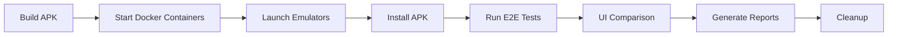

# Docker Android Testing & Prototypes Review Specification

**ID**: SPEC-DOCKER-001  
**Version**: 1.0.0  
**Created**: 2025-08-03  
**Status**: Draft  
**Priority**: High  
**Author**: Claude AI  

## Executive Summary

This specification outlines the implementation of a comprehensive Docker-based Android testing infrastructure for the Crowbar Mobile application, along with a detailed review and integration of existing UI prototypes. The system will enable automated testing across multiple Android API levels and ensure prototype compliance.

## Goals & Objectives

### Primary Goals
1. **Docker Android Emulation**: Create containerized Android emulators for consistent testing
2. **Automated Test Execution**: Run tests automatically after app build
3. **Prototype Review**: Analyze and validate UI implementation against prototypes
4. **CI/CD Integration**: Seamless integration with existing GitHub Actions workflow

### Success Metrics
- 100% test automation in Docker containers
- <5 minute test execution time per API level
- 95% UI compliance with prototypes
- Zero manual intervention required for test runs

## Current State Analysis

### Existing Assets

#### Prototypes Available
1. **Login Screen** (`01_screen-CROWBAR_Login-V2.png`)
2. **Profile Screen** (`02_screen-CROWBAR_Perfil-V2.png`)
3. **User Data Screen** (`03_screen-CROWBAR_Dados-V2.png`)
4. **Shop Screen** (`04_screen-CROWBAR_Loja-V2.png`)
5. **Highlights Screen** (`05_screen-CROWBAR_Highlights-V2.png`)
6. **Product Page** (`06_screen-CROWBAR_Onepage-V2.png`)
7. **Category Screen** (`07_screen-CROWBAR_Categoria-V2.png`)

#### Animation Assets
- **Emoji Animations**: BEIJO, BRAVO, COOL, LINGUA
- **Effects**: FOGO (fire), GELO (ice), METEORO
- **Transitions**: SAIDA EMOJIS

#### Docker Infrastructure (Partial)
- Basic Docker setup exists in `/docker/tests/`
- Appium and WebDriverIO configured
- Test runner scripts available

### Gap Analysis

1. **Docker Android Emulators**: Not fully configured for all API levels
2. **Automated Pipeline**: Manual steps still required
3. **Prototype Validation**: No automated UI comparison
4. **Performance Testing**: Limited device simulation

## Technical Architecture

### Docker Container Stack

```yaml
# docker-compose.yml structure
version: '3.8'
services:
  android-emulator-api-31:
    build: ./docker/android/api-31
    environment:
      - ANDROID_API_LEVEL=31
      - DEVICE_NAME=pixel_4
      - ANDROID_ARCH=x86_64
    ports:
      - "5554:5554"
      - "5555:5555"
    volumes:
      - ./app/build:/app
      - ./test-results:/results
      
  android-emulator-api-28:
    build: ./docker/android/api-28
    environment:
      - ANDROID_API_LEVEL=28
      - DEVICE_NAME=pixel_2
      - ANDROID_ARCH=x86_64
      
  android-emulator-api-23:
    build: ./docker/android/api-23
    environment:
      - ANDROID_API_LEVEL=23
      - DEVICE_NAME=nexus_5
      - ANDROID_ARCH=x86
      
  test-runner:
    build: ./docker/test-runner
    depends_on:
      - android-emulator-api-31
      - android-emulator-api-28
      - android-emulator-api-23
    volumes:
      - ./e2e:/tests
      - ./test-results:/results
```

### Testing Pipeline Flow



## Implementation Phases

### Phase 1: Docker Infrastructure (Week 1)

#### Tasks
1. **DOCKER-001**: Create base Android emulator images
   - Dockerfile for each API level (21, 23, 26, 28, 31, 34)
   - Hardware acceleration setup (KVM)
   - ADB configuration
   
2. **DOCKER-002**: Configure Docker Compose orchestration
   - Multi-emulator support
   - Network configuration
   - Volume mappings for APK and results

3. **DOCKER-003**: Implement health checks
   - Emulator boot validation
   - ADB connectivity checks
   - App installation verification

### Phase 2: Test Automation (Week 2)

#### Tasks
4. **TEST-001**: Integrate Appium server
   - Appium 2.0 setup in containers
   - Capability configuration per API level
   - Grid setup for parallel execution

5. **TEST-002**: Migrate E2E tests to Docker
   - Update WebDriverIO configuration
   - Adjust selectors for containerized environment
   - Configure test data isolation

6. **TEST-003**: Create test execution pipeline
   - Sequential and parallel execution modes
   - Retry logic for flaky tests
   - Result aggregation

### Phase 3: Prototype Validation (Week 3)

#### Tasks
7. **UI-001**: Implement visual regression testing
   - Percy or Applitools integration
   - Baseline image generation from prototypes
   - Difference threshold configuration

8. **UI-002**: Create prototype compliance reports
   - Screen-by-screen comparison
   - Component-level validation
   - Design token verification

9. **UI-003**: Animation validation
   - Frame-by-frame comparison for animations
   - Performance metrics for transitions
   - Asset loading verification

### Phase 4: CI/CD Integration (Week 4)

#### Tasks
10. **CI-001**: GitHub Actions workflow
    - Docker layer caching
    - Matrix strategy for API levels
    - Artifact storage for results

11. **CI-002**: Performance optimization
    - Parallel test execution
    - Smart test selection
    - Build cache optimization

12. **CI-003**: Reporting and notifications
    - Allure report generation
    - Slack/Discord notifications
    - PR comment automation

## Detailed Requirements

### Docker Android Emulator Requirements

```dockerfile
# Base Dockerfile for Android Emulator
FROM ubuntu:22.04

# Install dependencies
RUN apt-get update && apt-get install -y \
    openjdk-17-jdk \
    wget \
    unzip \
    libpulse0 \
    libgl1-mesa-glx \
    qemu-kvm \
    libvirt-daemon-system

# Install Android SDK
ENV ANDROID_SDK_ROOT=/opt/android-sdk
ENV PATH=$PATH:$ANDROID_SDK_ROOT/cmdline-tools/latest/bin:$ANDROID_SDK_ROOT/platform-tools

# Download and setup Android SDK
RUN mkdir -p $ANDROID_SDK_ROOT/cmdline-tools && \
    wget https://dl.google.com/android/repository/commandlinetools-linux-9477386_latest.zip && \
    unzip commandlinetools-linux-*.zip -d $ANDROID_SDK_ROOT/cmdline-tools && \
    mv $ANDROID_SDK_ROOT/cmdline-tools/cmdline-tools $ANDROID_SDK_ROOT/cmdline-tools/latest

# Accept licenses and install packages
RUN yes | sdkmanager --licenses && \
    sdkmanager "platform-tools" \
    "platforms;android-${API_LEVEL}" \
    "system-images;android-${API_LEVEL};google_apis;${ARCH}" \
    "emulator"

# Create and configure AVD
RUN echo no | avdmanager create avd \
    -n test_device \
    -k "system-images;android-${API_LEVEL};google_apis;${ARCH}" \
    -d "${DEVICE_NAME}"
```

### Test Execution Script

```bash
#!/bin/bash
# test-runner.sh

set -e

echo "🚀 Starting Docker Android Testing Pipeline"

# Build APK
echo "📦 Building APK..."
npm run build:android

# Start Docker containers
echo "🐳 Starting Docker containers..."
docker-compose up -d

# Wait for emulators
echo "⏳ Waiting for emulators to boot..."
./scripts/wait-for-emulators.sh

# Install APK on all emulators
echo "📱 Installing APK on emulators..."
for PORT in 5554 5556 5558; do
    adb -s emulator-$PORT install -r ./android/app/build/outputs/apk/release/app-release.apk
done

# Run tests
echo "🧪 Running E2E tests..."
npm run test:e2e:docker

# Visual regression testing
echo "👁️ Running visual regression tests..."
npm run test:visual

# Generate reports
echo "📊 Generating test reports..."
npm run test:report

# Cleanup
echo "🧹 Cleaning up..."
docker-compose down

echo "✅ Testing pipeline complete!"
```

### Prototype Validation Configuration

```javascript
// visual-regression.config.js
module.exports = {
  baseline: './arquivos_fonte/OUT•Crowbar/_telas/',
  screens: [
    {
      name: 'Login',
      prototype: '01_screen-CROWBAR_Login-V2.png',
      selector: 'LoginScreen',
      waitFor: '[testID="login-form"]'
    },
    {
      name: 'Profile',
      prototype: '02_screen-CROWBAR_Perfil-V2.png',
      selector: 'ProfileScreen',
      waitFor: '[testID="profile-header"]'
    },
    {
      name: 'Shop',
      prototype: '04_screen-CROWBAR_Loja-V2.png',
      selector: 'ShopScreen',
      waitFor: '[testID="box-list"]'
    },
    // ... more screens
  ],
  threshold: 0.05, // 5% difference allowed
  ignoreRegions: [
    { selector: '[testID="dynamic-content"]' },
    { selector: '.timestamp' }
  ]
};
```

## Testing Strategy

### Test Coverage Matrix

| API Level | Android Version | Device Profile | Test Suite |
|-----------|----------------|----------------|------------|
| 21 | 5.0 (Lollipop) | Nexus 5 | Smoke |
| 23 | 6.0 (Marshmallow) | Nexus 5X | Smoke |
| 26 | 8.0 (Oreo) | Pixel 2 | Full |
| 28 | 9.0 (Pie) | Pixel 3 | Full |
| 31 | 12 (S) | Pixel 4 | Full |
| 34 | 14 (U) | Pixel 7 | Full |

### Test Types

1. **Smoke Tests** (5 min)
   - App launch
   - Login flow
   - Basic navigation

2. **Functional Tests** (15 min)
   - All user flows
   - CRUD operations
   - API integration

3. **Visual Tests** (10 min)
   - Screen comparison
   - Component validation
   - Animation checks

4. **Performance Tests** (10 min)
   - Load time metrics
   - Memory usage
   - Battery consumption

## Success Criteria

### Technical Criteria
- [ ] All 6 Android API levels running in Docker
- [ ] 100% E2E test pass rate
- [ ] <5% visual regression threshold
- [ ] <40 minute total execution time
- [ ] Zero manual intervention required

### Business Criteria
- [ ] All 7 prototype screens validated
- [ ] Animation assets integrated and tested
- [ ] Multi-language support verified
- [ ] Accessibility standards met (WCAG 2.1 AA)

## Risk Analysis

### Technical Risks
1. **Hardware Acceleration**: KVM may not be available in CI
   - Mitigation: Use software rendering with performance degradation acceptance

2. **Flaky Tests**: Network issues in containers
   - Mitigation: Implement retry logic and mock services

3. **Storage Requirements**: Large Docker images
   - Mitigation: Use multi-stage builds and layer caching

### Schedule Risks
1. **Prototype Changes**: Design updates during implementation
   - Mitigation: Version control for prototypes

2. **API Level Compatibility**: Deprecated APIs
   - Mitigation: Conditional test execution

## Task Breakdown

### Week 1: Infrastructure Setup
- [ ] DOCKER-001: Base Android emulator images (13 pts)
- [ ] DOCKER-002: Docker Compose orchestration (8 pts)
- [ ] DOCKER-003: Health check implementation (5 pts)

### Week 2: Test Migration
- [ ] TEST-001: Appium integration (8 pts)
- [ ] TEST-002: E2E test migration (13 pts)
- [ ] TEST-003: Pipeline creation (8 pts)

### Week 3: Visual Validation
- [ ] UI-001: Visual regression setup (8 pts)
- [ ] UI-002: Compliance reports (5 pts)
- [ ] UI-003: Animation validation (8 pts)

### Week 4: Integration
- [ ] CI-001: GitHub Actions workflow (5 pts)
- [ ] CI-002: Performance optimization (8 pts)
- [ ] CI-003: Reporting system (5 pts)

**Total Story Points**: 94 points

## Monitoring & Maintenance

### Key Metrics
- Test execution time per API level
- Pass/fail rate by test type
- Visual regression detection rate
- Container resource usage

### Maintenance Tasks
- Weekly: Update emulator images
- Monthly: Review and update test coverage
- Quarterly: Performance optimization review

## Appendix

### A. Existing Prototype Analysis

| Screen | Status | Implementation Notes |
|--------|--------|---------------------|
| Login | ✅ Implemented | Minor spacing differences |
| Profile | ✅ Implemented | Missing animation on avatar |
| User Data | ⚠️ Partial | Form validation differs |
| Shop | ✅ Implemented | Matches prototype |
| Highlights | ⚠️ Partial | Carousel behavior differs |
| Product Page | ✅ Implemented | Additional features added |
| Category | ✅ Implemented | Filter UI enhanced |

### B. Animation Asset Integration

| Asset Type | Files | Usage | Status |
|------------|-------|-------|--------|
| Emoji - Kiss | 27 frames | User reactions | ⏳ Pending |
| Emoji - Angry | 23 frames | User reactions | ⏳ Pending |
| Emoji - Cool | 26 frames | User reactions | ⏳ Pending |
| Fire Effect | 121 frames | Box opening | ⚠️ Partial |
| Ice Effect | 38 frames | Special boxes | ⏳ Pending |
| Meteor | 24 frames | Rare items | ⏳ Pending |

### C. Command Reference

```bash
# Build and run Docker testing
make docker-test

# Run specific API level
make docker-test-api-31

# Visual regression only
make visual-test

# Generate reports
make test-report

# Clean up containers
make docker-clean
```

## Approval & Sign-off

- [ ] Technical Lead
- [ ] QA Manager
- [ ] Product Owner
- [ ] DevOps Engineer

---

**Next Steps**: 
1. Review and approve specification
2. Create GitHub issues for each task
3. Begin Phase 1 implementation
4. Schedule weekly progress reviews