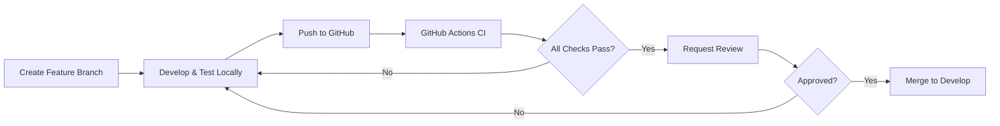

# GitHub Actions CI/CD - Crowbar Mobile

**Data**: 2025-11-06
**Versão**: 1.0.0
**Status**: ✅ Implementado

---

## 📋 Índice

- [Visão Geral](#visão-geral)
- [Workflows Implementados](#workflows-implementados)
- [Configuração Inicial](#configuração-inicial)
- [Secrets e Variáveis](#secrets-e-variáveis)
- [Como Usar](#como-usar)
- [Troubleshooting](#troubleshooting)
- [Monitoramento](#monitoramento)

---

## 🎯 Visão Geral

Sistema completo de CI/CD usando GitHub Actions para automatizar build, testes e deploy do Crowbar Mobile.

### Benefícios

- ✅ **Testes Automatizados**: E2E e unitários em cada PR
- ✅ **Build Automatizado**: APKs gerados automaticamente
- ✅ **Hardware KVM**: Emuladores Android com aceleração de hardware
- ✅ **Grátis**: 2000 minutos/mês para repositórios privados
- ✅ **Feedback Rápido**: Resultados em 15-30 minutos
- ✅ **Zero Configuração Local**: Não precisa de Docker ou emulador local

---

## 📦 Workflows Implementados

### 1. Android Build & Quality (`android-build.yml`)

**Quando executa:**
- ✅ Todos os pushes
- ✅ Todos os Pull Requests
- ✅ Tags de versão (v*.*.*)
- ✅ Manual (workflow_dispatch)

**O que faz:**
```
Jobs executados em paralelo:
├── Lint & Code Quality (10 min)
│   ├── ESLint
│   ├── Prettier Check
│   └── TypeScript Type Check
│
├── Unit Tests (15 min)
│   ├── Jest with Coverage
│   └── Upload to Codecov
│
├── Build Debug APK (20 min)
│   ├── Gradle Build
│   ├── Upload APK Artifact
│   └── Size Report
│
├── Build Release APK (25 min) [somente main/tags]
│   ├── Gradle Release Build
│   ├── Sign APK
│   ├── Upload APK + AAB
│   └── Create GitHub Release
│
└── Security Scan (10 min)
    ├── npm audit
    └── Sensitive Files Check
```

**Artifacts gerados:**
- `crowbar-debug-apk` (5 dias de retenção)
- `crowbar-release-apk` (30 dias de retenção)
- `crowbar-release-aab` (30 dias de retenção)

---

### 2. Android E2E Tests (`android-e2e.yml`)

**Quando executa:**
- ✅ Push para develop, main, release/*
- ✅ Pull Requests
- ✅ Manual com parâmetros customizáveis

**O que faz:**
```
Jobs:
├── Detox E2E Tests (45 min)
│   ├── Setup Node.js, Java, Android SDK
│   ├── Cache: Node modules, Gradle, AVD
│   ├── Build Android Debug APK
│   ├── Start Android Emulator (API 33)
│   └── Run Detox Tests
│
├── Smoke Tests (20 min)
│   ├── Quick build validation
│   └── Critical user flows
│
└── Test Results Summary
    ├── Collect results
    └── Generate summary report
```

**Artifacts gerados:**
- Screenshots de falhas (7 dias)
- Logs de teste (7 dias)
- Debug APKs (em caso de falha, 3 dias)

---

## 🔧 Configuração Inicial

### Passo 1: Habilitar GitHub Actions

1. Vá para Settings → Actions → General
2. Em "Actions permissions":
   - ✅ Allow all actions and reusable workflows
3. Em "Workflow permissions":
   - ✅ Read and write permissions
   - ✅ Allow GitHub Actions to create and approve pull requests

### Passo 2: Configurar Secrets (Opcional para Release)

Vá para Settings → Secrets and variables → Actions

#### Secrets Necessários para Release Builds:

```bash
# Android Keystore (Base64 encoded)
ANDROID_KEYSTORE_BASE64
# Comando para gerar:
base64 -i android/app/release.keystore | pbcopy

# Keystore Password
KEYSTORE_PASSWORD=sua_senha_aqui

# Key Alias
KEY_ALIAS=seu_alias_aqui

# Key Password
KEY_PASSWORD=sua_senha_key_aqui

# Codecov Token (Opcional)
CODECOV_TOKEN=seu_token_codecov
```

#### Como criar keystore (se não existe):

```bash
cd android/app

keytool -genkeypair -v \
  -storetype PKCS12 \
  -keystore release.keystore \
  -alias crowbar-release \
  -keyalg RSA \
  -keysize 2048 \
  -validity 10000

# Preencher informações solicitadas:
# - Senha do keystore
# - Nome, Organização, Cidade, Estado, País
# - Senha da key (pode ser a mesma)
```

### Passo 3: Configurar gradle.properties

Criar ou editar `android/gradle.properties`:

```properties
# Keystore configuration
CROWBAR_UPLOAD_STORE_FILE=release.keystore
CROWBAR_UPLOAD_KEY_ALIAS=crowbar-release
CROWBAR_UPLOAD_STORE_PASSWORD=***
CROWBAR_UPLOAD_KEY_PASSWORD=***
```

### Passo 4: Atualizar build.gradle

Editar `android/app/build.gradle`:

```gradle
android {
    ...
    signingConfigs {
        release {
            if (System.getenv("CI")) {
                // CI/CD environment
                storeFile file('release.keystore')
                storePassword System.getenv("KEYSTORE_PASSWORD")
                keyAlias System.getenv("KEY_ALIAS")
                keyPassword System.getenv("KEY_PASSWORD")
            } else {
                // Local development
                storeFile file(CROWBAR_UPLOAD_STORE_FILE)
                storePassword CROWBAR_UPLOAD_STORE_PASSWORD
                keyAlias CROWBAR_UPLOAD_KEY_ALIAS
                keyPassword CROWBAR_UPLOAD_KEY_PASSWORD
            }
        }
    }

    buildTypes {
        release {
            signingConfig signingConfigs.release
            minifyEnabled true
            proguardFiles getDefaultProguardFile('proguard-android-optimize.txt'), 'proguard-rules.pro'
        }
    }
}
```

---

## 🚀 Como Usar

### Executando Workflows Automaticamente

Os workflows executam automaticamente quando você:

```bash
# 1. Faz push para develop ou main
git push origin develop

# 2. Cria Pull Request
gh pr create --base develop --head feature/nova-feature

# 3. Cria tag de versão
git tag v1.0.0
git push origin v1.0.0
```

### Executando Manualmente

#### Via GitHub Web UI:

1. Vá para Actions
2. Selecione o workflow desejado
3. Click em "Run workflow"
4. Escolha parâmetros (se aplicável)
5. Click em "Run workflow"

#### Via GitHub CLI:

```bash
# Executar workflow de build
gh workflow run "Android Build & Quality"

# Executar workflow de E2E
gh workflow run "Android E2E Tests"

# Executar E2E com parâmetros customizados
gh workflow run "Android E2E Tests" \
  -f api_level=33 \
  -f test_suite=smoke
```

---

## 📊 Monitorando Execuções

### Via GitHub Web UI

1. Vá para aba "Actions" do repositório
2. Veja lista de execuções recentes
3. Click em execução para ver detalhes
4. Expandir jobs para ver logs

### Via GitHub CLI

```bash
# Listar execuções recentes
gh run list

# Ver detalhes de uma execução
gh run view <run-id>

# Ver logs de uma execução
gh run view <run-id> --log

# Baixar artifacts
gh run download <run-id>
```

### Interpretando Resultados

#### ✅ Sucesso (Green Check)
- Todos os jobs passaram
- APKs gerados com sucesso
- Testes executados sem falhas

#### ❌ Falha (Red X)
- Um ou mais jobs falharam
- Verifique logs do job que falhou
- Screenshots/artifacts disponíveis (se E2E)

#### 🟡 Em Progresso (Yellow Dot)
- Workflow ainda executando
- Tempo médio: 15-45 minutos

#### ⏸️ Cancelado (Gray Circle)
- Workflow foi cancelado manualmente
- Ou cancelado por novo push (concurrency)

---

## 🔍 Troubleshooting

### Problema: Build Falhando no Gradle

**Sintoma:**
```
FAILURE: Build failed with an exception.
* What went wrong:
Execution failed for task ':app:packageDebug'.
```

**Solução:**
```bash
# Limpar cache local
cd android
./gradlew clean

# Invalidar cache do Gradle
./gradlew --stop
rm -rf ~/.gradle/caches/

# Rebuild
./gradlew assembleDebug --stacktrace
```

---

### Problema: Testes E2E Falhando

**Sintoma:**
```
Timeout waiting for emulator to boot
```

**Solução:**
1. Verificar timeout do emulador (padrão: 300s)
2. Aumentar timeout no workflow:
```yaml
env:
  EMULATOR_TIMEOUT: 600  # 10 minutos
```

---

### Problema: Keystore não encontrado

**Sintoma:**
```
FileNotFoundException: release.keystore
```

**Solução:**
1. Verificar se secret `ANDROID_KEYSTORE_BASE64` está configurado
2. Verificar script de decodificação no workflow:
```yaml
- name: Setup Keystore
  run: |
    echo "${{ secrets.ANDROID_KEYSTORE_BASE64 }}" | base64 -d > android/app/release.keystore
```

---

### Problema: Cobertura de Código Baixa

**Sintoma:**
```
Coverage: 45% - Target: 80%
```

**Solução:**
1. Identificar arquivos sem cobertura:
```bash
npm run test:coverage
# Abrir coverage/lcov-report/index.html
```

2. Adicionar testes para arquivos identificados
3. Executar localmente antes de commit

---

### Problema: Workflow muito lento

**Sintoma:**
- Execução leva mais de 1 hora
- Timeout frequente

**Solução:**
1. Habilitar cache para dependências:
```yaml
- uses: actions/cache@v4
  with:
    path: node_modules
    key: ${{ runner.os }}-node-${{ hashFiles('**/package-lock.json') }}
```

2. Paralelizar jobs:
```yaml
strategy:
  matrix:
    test-suite: [unit, integration, e2e]
```

3. Usar workers para testes:
```bash
npm run test -- --maxWorkers=2
```

---

## 📈 Métricas e Análises

### Tempo Médio por Workflow

| Workflow | Tempo Médio | Timeout |
|----------|-------------|---------|
| Build & Quality | 15-20 min | 30 min |
| E2E Tests | 30-45 min | 60 min |
| Smoke Tests | 10-15 min | 20 min |

### Consumo de Minutos

**Conta Gratuita:**
- ✅ 2000 minutos/mês para repositórios privados
- ✅ Ilimitado para repositórios públicos

**Estimativa de uso:**
```
Pushes diários: ~20
Minutos por push: ~20min (build only)
Minutos mensais: ~20 * 20 * 20 = 8000min

Recomendação: Atualizar para plan pago ou usar self-hosted runners
```

---

## 🎓 Boas Práticas

### 1. Commits Semânticos

Use conventional commits para mensagens claras:

```bash
feat: adicionar animação de loading
fix: corrigir crash no carrinho
test: adicionar testes E2E para checkout
docs: atualizar README com instruções de CI
```

### 2. Branch Protection Rules

Configurar regras em Settings → Branches:

- ✅ Require pull request reviews before merging
- ✅ Require status checks to pass before merging
  - `Lint & Code Quality`
  - `Unit Tests`
  - `Build Debug APK`
- ✅ Require branches to be up to date before merging

### 3. Code Review Workflow



### 4. Gestão de Artifacts

```bash
# Baixar APK de uma execução
gh run download <run-id> -n crowbar-debug-apk

# Listar artifacts disponíveis
gh run view <run-id> --json artifacts --jq '.artifacts[] | {name,size,url}'

# Baixar todos artifacts de última execução
gh run download --name "crowbar-*"
```

---

## 🔗 Recursos Adicionais

### Documentação Oficial
- [GitHub Actions Docs](https://docs.github.com/en/actions)
- [Android Emulator Runner](https://github.com/ReactiveCircus/android-emulator-runner)
- [React Native CI/CD Guide](https://reactnative.dev/docs/running-on-device)

### Workflows de Referência
- [React Native Template](https://github.com/react-native-community/template)
- [Detox CI Examples](https://github.com/wix/Detox/tree/master/examples/demo-react-native/.github/workflows)

---

**Última Atualização**: 2025-11-06 10:30 BRT
**Versão**: 1.0.0
**Autor**: Claude Code

*GitHub Actions CI/CD - Automação completa de build, testes e deploy para Crowbar Mobile* 🚀🤖✅
